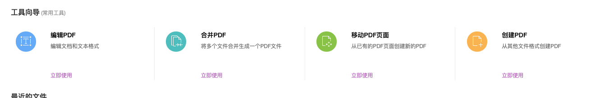
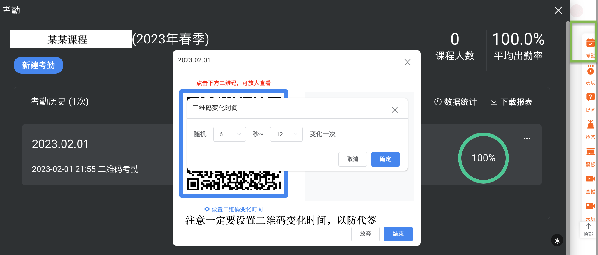

# Survival Manual for TA
- [Survival Manual for TA](#survival-manual-for-ta)
  - [1. 学期前](#1-学期前)
  - [2. 学期中](#2-学期中)
    - [2.1 第一周特殊任务](#21-第一周特殊任务)
    - [2.1 周日上课](#21-周日上课)
    - [2.2 上机课 🅱️🅰️](#22-上机课-️️)
    - [2.3 周五周六课前准备](#23-周五周六课前准备)
  - [3. 雷区](#3-雷区)
  - [4. 期末打分](#4-期末打分)
    - [期末项目](#期末项目)
  - [最终成绩打分](#最终成绩打分)


## 1. 学期前

- [ ] PPT 更新
  - 助教信息
  - 更换最新的课堂派截图
  - **线性回归模型选择那里**有一个BUG，**线性回A归**，记得把A去掉！！！
- [ ] 整合 PPT 为一整个 PDF 文件
  - 例如使用`福昕高级PDF编辑器`里的`合并PDF`功能
  - 发送给教务老师，打印课件后需要搬运，课上负责分发给同学们
  - PDF 上传至课堂派资料区，**原始PPT文件【不可以】发给同学【不可以】上传至课堂派**，如果有同学需要只能发送 PDF
- [ ] `课堂派`->`备课区`->`题库` 和 `课堂派`->`备课区`->`作业` 从备课区导入全部测试和作业，此时不用点击发布，学期中每周课前发布即可

## 2. 学期中

### 2.1 第一周特殊任务

- [ ] 发dog bear club VIP优惠券 🅱️
  - 联系dog bear club工作人员，会按照目前选课人数发优惠券
  - 整个步骤包括：**优惠券领取**+**兑换VIP**，领取后一定要确认是否能收看会员课程，不能收看就是没有兑换成功，没有兑换一天后优惠券会失效，一定一定要领取后就立马兑换！可以让第一位兑换成功的同学发送成功兑换vip的截图到群里，这样大家就会知道应该出现什么界面

- [ ] **制作线上问卷**，让同学选上机时间 🅱️


### 2.1 周日上课

- [ ] 课前询问老王喝什么，他一般喜欢喝柚子茶/美式 🅰️

- [ ] 课前教学工具 🅰️
  - 一楼保安处的马克笔和水
  - 一楼咖啡厅的饮料（老王喜欢喝柚子茶、美式咖啡）
  - 二楼拿翻页笔、扩音器，如有线上同学需要拿摄像头（没有就不用）
  - 二楼办公室，打印的课件（一般前几个星期需要带着）+名牌（每周带着）
  - 拷贝这次课的课件到教室电脑上，可能会存在自动播放的bug，还需要检查翻页笔是否能用
  
- [ ] 课前签到 🅰️
  - 使用课堂派动态二维码扫码签到
  - 第一节课下了可以补签，之后不可以
  

- [ ] 课前发布测试和作业 🅱️
  - 【上课前】发布测试和作业，发布本周内学习的内容相关的即可
  - 测试截止时间：【周二中午14点结束】
  - 作业截止时间：【周六晚上11点结束】
  - 测试截止后，在`课堂派`->`资料区`公布答案，答案从测试下载，导出试题后为word文档，需要转成pdf才能发给同学们


- [ ] 课中记录课堂纪要 🅰️🅱️
  > 每节课需要记课堂纪要，注意每年老王会修改PPT，所以之前的课堂纪要不能全部copy，需要适应性修改，最好每周鼓励一下同学们坚持下去

  > 以往的课堂纪要记录在 `课堂派`->`备课区`->`公告` 目录下，或者直接去看以往课程里的课堂纪要
  
  - 课后课堂纪要上传至课堂派公告区


### 2.2 上机课 🅱️🅰️
  > 原则上每周两次，一次线下（一般会设在上课的那天晚上因为大家难得跑一趟），一次线上（录屏上传课堂派），可以两个助教一人负责一周

  > 内容和老师上课讲的内容保持一致，即绿皮书代码，顺便答疑

  > 以往的代码记录在 `课堂派`->`备课区`->`资料`->`代码.zip` 下


### 2.3 周五周六课前准备

- [ ] 【周五】发给老王小测总结PPT 🅱️
  - 学生成绩做一个直方图，放在PPT第一页。因为一共4个测试，那么平均分一下。没有完成测试的0分

  - 把准确率不到90%的题目，摘出来，一个题目一页PPT，截图就可以

  - 代码见 `/tests/`，建议结构如下，其中xls文件从课堂派小测处下载

  ```
  tests
  ├── 小测1
  │   ├── 1.1：从不确定性开始_成绩_截止02月23日09时40分_成绩统计.xls
  │   ├── 1.2：回归分析（道）_成绩_截止02月23日09时48分_成绩统计.xls
  │   ├── 1.3：预测不准是常态_成绩_截止02月23日09时48分_成绩统计.xls
  │   ├── 1.4：朴素的数据价值观_成绩_截止02月23日09时48分_成绩统计.xls
  └── 每周小测成绩统计.R
  ```

- [ ] 【周六】询问老王PPT更改 🅰️
  - 截图本周的PPT发到助教群里，询问老王是否更新PPT

## 3. 雷区

> 请注意以下情况，否则老王很有可能小发雷霆

- 同学进入微信群：不备注真名的需要多次提醒，不允许随意拉没选课的同学，退课的人需要及时踢掉（包括微信群和课堂派）
- 迟到：迟到的理由不重要，只要超过第一节课课间，都记为旷课
- 旁听：旁听需要全程完成作业，包括最后的项目，只要有一次没参加就大概率需要踢掉
- 线上：原则上不允许线上，不允许因为工作忙等原因申请线上，如果是极其特殊的情况（比如新冠封控的时候），需要这位同学向教务老师申请，申请通过之后才会安排线上听课的腾讯会议，如果连续请假，需要**每周申请**，**每周申请**，**每周申请**，每申请一周才会安排腾讯会议，其余情况不来当作旷课处理
- 偶尔会出现学生基础实在太差，而且不努力，这样的学生会被老王劝退，但是那个时候可能已经过了退课时间了，所以最好在可以退课的时候劝告同学退课，否则大概率是F

## 4. 期末打分

> 平时个人作业(50%)+平时个人测验(30%)+小组期末项目(20%)
> - 缺席:第一次不扣分，第二次开始，缺席一次扣5分
> - 迟到:一次扣1分
> 
> 虽然但是，课堂派上记录签到&旷课，不记录迟到

### 期末项目

- 小组的期末项目打分评委：老王（50%）+ 🅰️🅱️（各25%）
- [ ] 打分表见 `/docs/期末项目打分表.xlsx`，线下需要打印成纸质版
- [ ] 期末汇报时随机分组，🅰️ 计时并提醒
- [ ] 汇报结束后 🅱️ 收集打分表，录入电子版，整理成规范的成绩小分

## 最终成绩打分

待更新